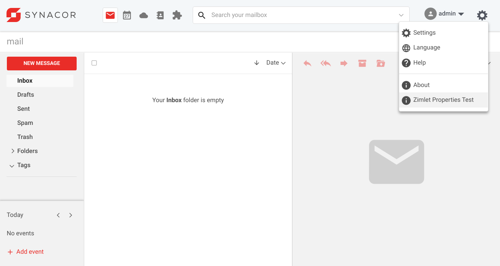
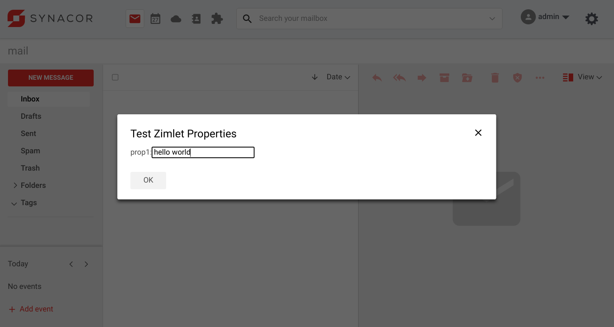
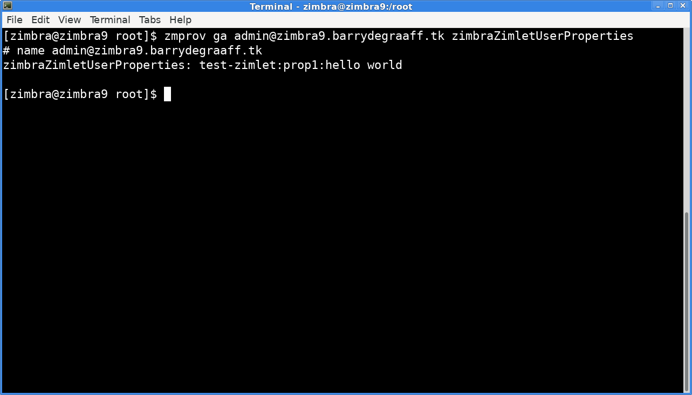

# Zimlet User Properties

Zimlets can have administrator controlled, globally set configuration properties as described in https://github.com/Zimbra/zimbra-zimlet-configuration. However often when writing Zimlets there is a need to store per-user Zimlet related settings or preferences. This is when Zimlet User Properties can be used.

Using Zimlet User Properties avoids the need for cookies on the client side as the settings will be fetched from the server. This way the user's Zimlets settings are the same on all devices and preferences can be retained.

- Zimlet User Properties are not intended to store passwords or other sensitive information.
- Zimlet User Properties are stored in the LDAP field `zimbraZimletUserProperties`.

## Downloading and running the Zimlet User Properties Zimlet

Create a folder on your local computer to store the Zimlet User Properties Zimlet:

      mkdir ~/zimbra_course_pt11
      cd ~/zimbra_course_pt11
      git clone https://github.com/Zimbra/zimbra-zimlet-user-properties
      cd zimbra-zimlet-user-properties
      npm install
      zimlet watch

The output of this command should be:

```
Compiled successfully!

You can view the application in browser.

Local:            https://localhost:8081/index.js
On Your Network:  https://192.168.1.100:8081/index.js
```

Visit https://localhost:8081/index.js in your browser and accept the self-signed certificate. The index.js is a packed version of the `Zimlet User Properties Zimlet`. More information about the zimlet command, npm and using SSL certificates can be found in https://github.com/Zimbra/zm-zimlet-guide. 

## Sideload the Zimlet User Properties Zimlet

Log on to your Zimbra development server and make sure that you are seeing the modern UI. Then append `/sdk/zimlets` to the URL.

> 
*Sideload the Zimlet User Properties Zimlet by clicking Load Zimlet. The Zimlet is now added to the Zimbra UI in real-time. No reload is necessary.*

> 
*Zimlet Properties Test button in Gear menu.*

> 
*Dialog to read and set a Zimlet property.*

## Visual Studio Code

The `Zimlet User Properties Zimlet` is not a real-world example Zimlet. Instead it has pieces of code that can be used as a cookbook reference. To learn from this Zimlet you should open it in Visual Studio Code and take a look at the methods implemented in the `Zimlet Properties Test` button.


Open the folder `~/zimbra_course_pt11/zimbra-zimlet-user-properties` in Visual Studio Code to take a look at the code in the Zimlet User Properties Zimlet. The general structure of the Zimlet and the way menu's are implemented in Zimlet slots has been described in previous guides. Refer to https://wiki.zimbra.com/wiki/DevelopersGuide#Zimlet_Development_Guide.

## Zimlet User Properties Zimlet

The file src/components/display/index.js implements the fetching and saving of Zimlet User Properties if the user clicks the `OK` button in the dialog that shows under Gear Menu -> Zimlet Properties Test. The in-code comments explain how it works:

```javascript
import { createElement, Component } from 'preact';
import style from './style';
import { useApolloClient, gql } from '@apollo/client';
import { ModalDialog } from '@zimbra-client/components';

// On the server you can run the following command to get the Zimlet User Properties:
// zmprov ga user@example.com zimbraZimletUserProperties

export default class Display extends Component {
    constructor(props) {
        super(props);
        this.zimletContext = props.children.context;
    };

    fetchData = () => {
        //if we already parsed and cached our Zimlet User Properties, display them
        if (this.zimletContext.zimletProperties) {
            this.showDialog();
        }
        else {
            //Fetch Zimlet User Properties from server parse and save them to Zimlet context
            //Create new empty map to store the test Zimlet properties
            this.zimletContext.zimletProperties = new Map();

            //this gql query is used to get all current saved Zimlet properties for all Zimlets for the current user from the server
            this.zimletProps = gql`
                query AccountInfo {
                    accountInfo {
                        id
                        props {
                            prop {
                                zimlet
                                name
                                _content
                            }
                        }
                    } 
                }`;

            const client = this.zimletContext.getApolloClient();
            client.query({
                query: this.zimletProps
            })
                .then((response) => {
                    if (response.data.accountInfo.props.prop) {
                        //Filter out the test-zimlet properties, excluding all other Zimlets
                        //add all our properties to an ES6 Map
                        const propArray = response.data.accountInfo.props.prop;
                        for (var i = 0; i < propArray.length; i++) {
                            if ((propArray[i].zimlet == "test-zimlet") && (propArray[i].__typename == "Prop")) {
                                this.zimletContext.zimletProperties.set(propArray[i].name, propArray[i]._content);
                            }
                        }
                        //https://developer.mozilla.org/en-US/docs/Web/JavaScript/Reference/Global_Objects/Map
                        //Now you can get a property value by doing: zimletProperties.get('name-of-property')
                        this.showDialog();
                    }
                })
                .catch((err) => console.error(err));
        }
    }

    showDialog = () => {
        this.modal = (
            <ModalDialog
                class={style.modalDialog}
                contentClass={style.modalContent}
                innerClass={style.inner}
                onClose={this.handleClose}
                cancelButton={false}
                header={false}
                footer={false}
            >
                <div class="zimbra-client_modal-dialog_inner"><header class="zimbra-client_modal-dialog_header"><h2>Test Zimlet Properties</h2><button onClick={this.handleClose} aria-label="Close" class="zimbra-client_close-button_close zimbra-client_modal-dialog_actionButton"><span role="img" class="zimbra-icon zimbra-icon-close blocks_icon_md"></span></button></header>
                    <div class="zimbra-client_modal-dialog_content zimbra-client_language-modal_languageModalContent">
                        <lable for='prop1'>prop1:</lable><input name='prop1' id='prop1' value={this.zimletContext.zimletProperties.get('prop1') || null}></input>
                    </div>
                    <footer class="zimbra-client_modal-dialog_footer"><button type="button" onClick={this.handleSave} class="blocks_button_button blocks_button_regular">OK</button></footer>
                </div>
            </ModalDialog>
        );

        const { dispatch } = this.zimletContext.store;
        dispatch(this.zimletContext.zimletRedux.actions.zimlets.addModal({ id: 'addEventModal', modal: this.modal }));
    }

    handleSave = e => {
        //Get value from user input
        const prop1 = window.parent.document.getElementById('prop1').value;

        //Update Zimlet User Properties cache in the Zimlet Context 
        this.zimletContext.zimletProperties.set('prop1', prop1);

        //The gql mutation that stores to ldap zimbraZimletUserProperties on the server
        const myMutationGql = gql`
            mutation myMutation($props: [PropertiesInput!]) {
                modifyProps(props: $props)
            }`;

        //Use the Apollo client directly to run the query, save prop1 on the server
        //https://stackoverflow.com/questions/56417197/apollo-mutations-without-react-mutation-component
        const client = this.zimletContext.getApolloClient();
        client.mutate({
            mutation: myMutationGql,
            variables: {
                props: [
                    {
                        zimlet: "test-zimlet",
                        name: 'prop1',
                        _content: prop1
                    }
                ]
            }
        });

        //Close the dialog
        const { dispatch } = this.zimletContext.store;
        return e && e.isTrusted && dispatch(this.zimletContext.zimletRedux.actions.zimlets.addModal({ id: 'addEventModal' }));
    }

    handleClose = e => {
        //Close the dialog without saving
        const { dispatch } = this.zimletContext.store;
        return e && e.isTrusted && dispatch(this.zimletContext.zimletRedux.actions.zimlets.addModal({ id: 'addEventModal' }));
    }

    render() {
        return (
            <div onClick={this.fetchData} class="zimbra-client_menu-item_navItem zimbra-client_action-menu-item_item">
                <span class="zimbra-client_action-menu-item_icon">
                    <span role="img" class="zimbra-icon zimbra-icon-about blocks_icon_md"></span></span>
                <span class="zimbra-client_menu-item_inner">Zimlet Properties Test</span></div>
        );
    }
}
```

## Read Zimlet User Properties using zmprov

To verify if a Zimlet User Property is actually stored on the server, you can use the following command:

      zmprov ga user@example.com zimbraZimletUserProperties

> 
*Using zmprov to get zimbraZimletUserProperties.*

## References

- https://files.zimbra.com/docs/soap_api/9.0.0/api-reference/zimbraAccount/GetAccountInfo.html
- https://files.zimbra.com/docs/soap_api/9.0.0/api-reference/zimbraAccount/ModifyProperties.html
 
